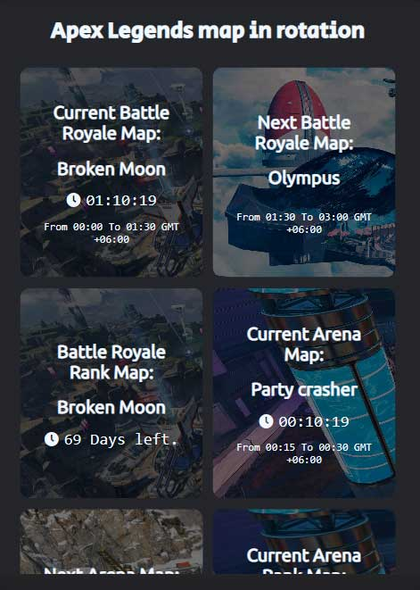

# ApexLegendsMapRotation

This is a progressive web app means you can install this app as an app in your PC, android and iPhone devices. The PWA lets you know the whole Map rotation data of Apex Legends.

## Acknowledgements

 - [Apex legends maps API ](https://apexlegendsapi.com/)
<!-- ## Demo

Insert gif or link to demo -->

## FAQ

#### How to update the app

The refresh like any other websites you do.

## 🚀 About Me
I'm a Software Engineer, currently working as a iOS developer @BJIT Limited

## 🔗 Links

## Screenshots

App Screenshot | Shows all internal, external and virtual cameras
--- | ---
 | 

   
